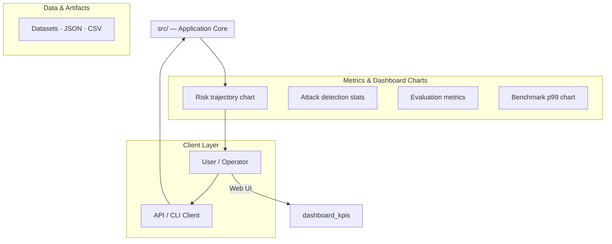
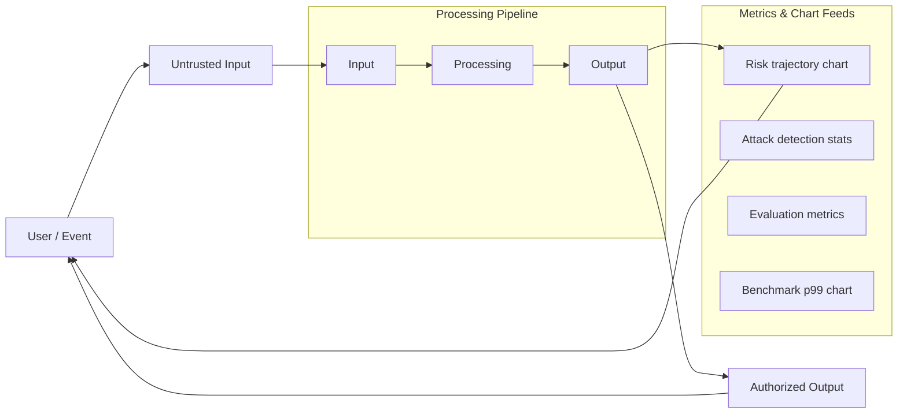
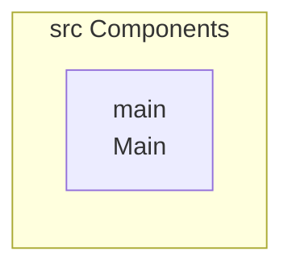
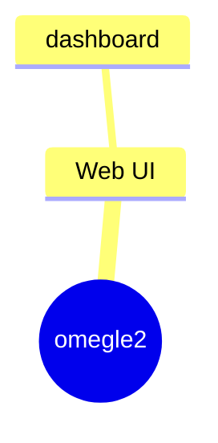
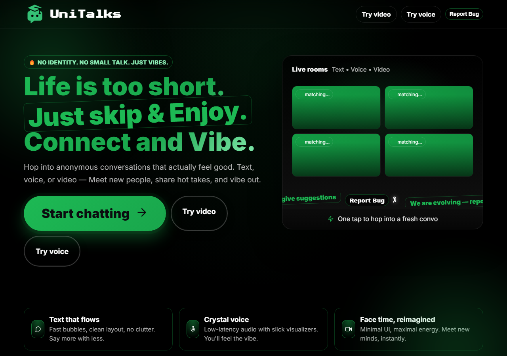

# UniTalks - Frontend Application

A modern, clean frontend application for the UniTalks college social platform with essential pages and components.

## Features

- **Homepage** - Modern landing page with animated elements
- **Start Chat** - Chat mode selection page
- **About** - Information about the platform
- **Privacy Policy** - Comprehensive privacy policy
- **Terms of Service** - Terms and conditions
- **Help Center** - Support and bug reporting
- **Contact** - Contact form
- **Video Chat** - Video chat interface
- **Maintenance Pages** - Coming soon pages for voice and text chat

## Project Structure

```
src/
├── components/
│   ├── layout/
│   │   ├── Header.js          # Navigation header component
│   │   └── Footer.js           # Site footer component
│   ├── pages/
│   │   ├── Homepage.js        # Landing page
│   │   ├── StartChat.js       # Chat mode selection
│   │   ├── About.js           # About page
│   │   ├── Privacy.js          # Privacy policy
│   │   ├── Terms.js            # Terms of service
│   │   ├── Help.js             # Help center
│   │   ├── Contact.js          # Contact form
│   │   ├── VideoChat.js        # Video chat interface
│   │   └── MaintenancePage.js  # Maintenance/coming soon pages
│   └── ui/
│       ├── ReportBugModal.js   # Bug reporting modal
│       └── UniversalHamburger.js # Mobile navigation menu
├── config/
│   └── theme.js               # Theme configuration
├── utils/
│   └── performanceOptimizations.js # Performance utilities
├── App.js                     # Main app component with routing
└── index.js                   # Application entry point
```

## Setup

1. Install dependencies:
```bash
npm install
```

2. Start the development server:
```bash
npm start
```

3. Build for production:
```bash
npm run build
```

## Dependencies

- **React** 18.2.0 - UI library
- **React Router DOM** 6.22.0 - Routing
- **Styled Components** 6.1.8 - CSS-in-JS styling
- **React Icons** 5.2.1 - Icon library
- **Socket.IO Client** 4.7.2 - WebSocket client (for future features)
- **Web Vitals** 3.5.0 - Performance monitoring

## Features

- ✅ Responsive design
- ✅ Dark theme with Spotify green accents
- ✅ Mobile-first approach
- ✅ Clean, modern UI
- ✅ Bug reporting functionality
- ✅ Contact forms
- ✅ SEO optimized
- ✅ Performance optimizations for low-powered devices

## Environment Variables

Create a `.env` file in the root directory:

```
REACT_APP_WEB3FORMS_KEY=your_web3forms_key_here
```

This is used for the bug reporting and contact forms.

## Code Organization

The project follows a modern, organized structure:

- **Layout Components** (`components/layout/`) - Reusable layout components like Header and Footer
- **Page Components** (`components/pages/`) - Individual page components
- **UI Components** (`components/ui/`) - Reusable UI components like modals and menus
- **Config** (`config/`) - Configuration files like theme
- **Utils** (`utils/`) - Utility functions

## License

All rights reserved to UniTalks.
# omegle
# omegle
# omegle2

## Setup Guide

### Backend Setup

_From `README.md`:_


1. Install dependencies:
```bash
npm install
```

2. Start the development server:
```bash
npm start
```

3. Build for production:
```bash
npm run build
```


### Frontend Setup

```bash

npm install
npm run dev     # development
npm run build && npm start   # production
```

Open `http://127.0.0.1:3000` (or the port shown in the terminal).

### Running the Application

1. **Start web app** — `npm run start` in `./`

```bash
cd .
npm install
npm run start
```

## System Architecture

High-level system design, data flows, API map, and workflow pipelines derived from the repository structure.

### System Architecture



### Data Flow & Charts Pipeline



### Component & API Map



### Application Page Map



## Screenshots & Assets


## Application Pages

Screenshots captured from the running application. Each page is listed with its function.

### Application

#### Home

Home — application page at `/`


