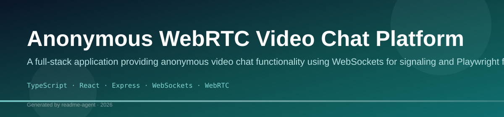
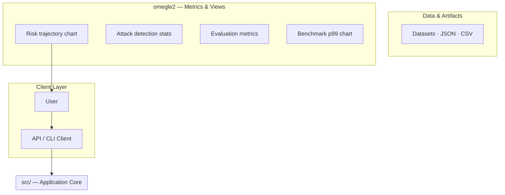
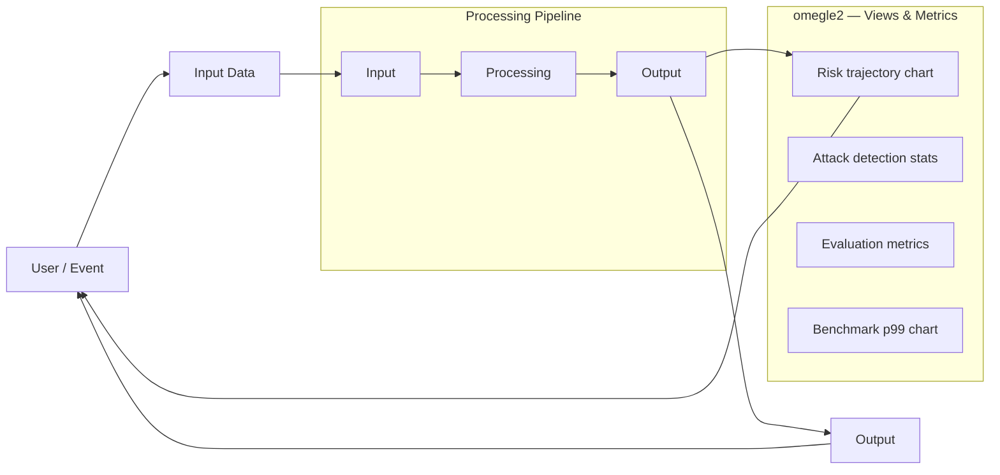
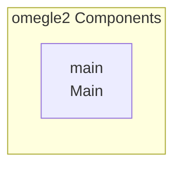
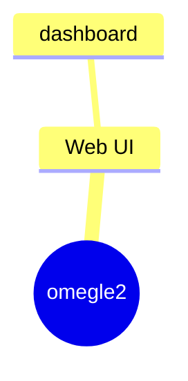

# Anonymous WebRTC Video Chat Platform

A full-stack application providing anonymous video chat functionality using WebSockets for signaling and Playwright for load testing.

## Overview

This project implements a real-time, anonymous video chat platform. The system is composed of a robust backend server responsible for WebRTC signaling, user authentication, and matchmaking queue management, and a separate client application (implied by the React entry point). A dedicated load testing suite uses Playwright to validate the scalability and performance of the backend under various concurrent user loads.

## Problem

The need for a scalable, real-time platform that facilitates anonymous video communication, requiring reliable signaling, session management, and robust performance under high concurrency.

## Solution

The solution consists of a TypeScript/Express backend that manages the WebRTC signaling process via WebSockets. It uses JWT for authentication and implements a FIFO matchmaking queue to pair users automatically. The system is designed to be scalable, with dedicated load testing scripts to ensure stability when handling thousands of concurrent connections.

## Key Features

- Anonymous video chat sessions
- JWT-based user authentication
- WebSockets signaling for WebRTC (offer/answer/ICE exchange)
- FIFO matchmaking queue system
- Heartbeat mechanism for connection monitoring
- Auto-requeue functionality for failed sessions
- Load testing capabilities for simulating high concurrency (up to 1000 users)

## Technology Stack

- TypeScript
- React
- Express
- WebSockets
- WebRTC
- jsonwebtoken
- dotenv
- ioredis
- Playwright

# 📚 Project Documentation Overview

This repository appears to contain documentation and code snippets for multiple, distinct projects, including a Web3 Chat/Video application, a video streaming service (Omegle), and a complex Data Analytics/Metrics Dashboard. 

Please refer to the specific sections below for details on each module.

***

## 💬 UniTalks / Web3 Forms (Chat & Video Application)

This module describes a comprehensive, modern chat and video communication platform built with React and Styled Components. It focuses on providing a responsive and feature-rich user experience, including dark mode support and various chat functionalities.

### ✨ Features
*   **Video Chat:** Dedicated component for real-time video communication (`VideoChat.js`).
*   **Chat Functionality:** Supports standard messaging and chat history.
*   **Theming:** Includes support for a dark theme.
*   **Responsiveness:** Designed to work across various screen sizes.
*   **Web3 Integration:** Implies integration with decentralized web technologies (Web3Forms).

### 🚀 Getting Started

To set up and run the UniTalks application:

1.  **Installation:**
    ```bash
npm install
    ```
2.  **Running the Application:**
    ```bash
npm start
    ```

### 📁 Core Components
*   `StartChat.js`: Likely the main entry point for initiating a chat session.
*   `About.js`: Component for displaying information about the application.
*   `VideoChat.js`: Handles the core video conferencing logic.
*   `Styled Components`: Used for managing the application's styling and themes.

***

## 📹 Omegle Clone / Video Streaming Service

This section outlines the structure for a real-time video streaming application, similar to Omegle. It suggests a separation between the frontend client and the backend server logic.

### ⚙️ Architecture
*   **Frontend:** Handles the user interface and video capture/display.
*   **Backend:** Manages the connection logic, user pairing, and streaming data.

### 🚀 Setup Guide

*   **Frontend Setup:** The client-side application needs to be initialized and run.
*   **Backend Setup:** The server component must be configured to handle real-time connections (e.g., WebSockets).

***

## 📊 Data Analytics & Metrics Dashboard

This module describes a sophisticated, data-intensive dashboard designed for monitoring system health, security threats, and operational metrics. It utilizes complex data flow and multiple interconnected components.

### 📈 Key Monitoring Areas
*   **Risk Trajectory:** Visualizing the progression and severity of identified risks.
*   **Attack Detection Stats:** Providing real-time statistics and visualizations related to security breaches or attempted attacks.
*   **System Metrics:** Tracking general operational data and performance indicators.

### 🗺️ System Architecture (Conceptual Flow)

The system relies on a multi-stage data pipeline:

1.  **Data Sources:** Raw data is ingested from various sources (e.g., logs, sensors, APIs).
2.  **Processing Layer:** Data undergoes cleaning, transformation, and aggregation.
3.  **Storage:** Processed data is stored in a structured manner.
4.  **Presentation:** The dashboard consumes the processed data to render visualizations and alerts.

### 🧩 Components
*   **Datasets:** The core data repositories used by the dashboard.
*   **Risk Trajectory Component:** Visualizes risk over time.
*   **Attack Detection Component:** Displays security statistics and alerts.
*   **Dashboard Pages:** The front-end views that consume the data and present the insights.

## Setup Guide

### Backend Setup

_From `README.md`:_


1. Install dependencies:
```bash
npm install
```

2. Start the development server:
```bash
npm start
```

3. Build for production:
```bash
npm run build
```


### Frontend Setup

```bash

npm install
npm run dev     # development
npm run build && npm start   # production
```

Open `http://127.0.0.1:3000` (or the port shown in the terminal).

### Running the Application

1. **Start web app** — `npm run start` in `./`

```bash
cd .
npm install
npm run start
```

## System Architecture

High-level system design, data flows, API map, and workflow pipelines derived from the repository structure.

### System Architecture



### Data Flow & Charts Pipeline



### Component & API Map



### Application Page Map



## Screenshots & Assets


## Application Pages

Screenshots captured from the running application. Each page is listed with its function.

### Application

#### Home

Home — application page at `/`


